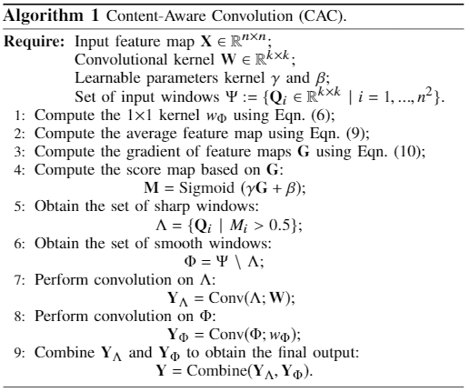

# Content-Aware Convolution for Efficient Deep Neural Networks

Pytorch implementation for "Content-Aware Convolution for Efficient Deep Neural Networks".

## Demonstration of CAC

<p align="center">
    
</p>

## Requirements
```
Python>=3.6, PyTorch==1.2.0, torchvision==0.4.0 pyhocon flame
```

Please follow the [guide](https://github.com/chenyaofo/flame) to install flame.

## Datasets
We consider two benchmark classification datsets, including CIFAR-10 and ImageNet.

CIFAR-10 can be automatically downloaded by torchvision.

ImageNet needs to be manually downloaded (preferably to a SSD) following the instructions [here](https://github.com/pytorch/examples/tree/master/imagenet).

## Training Algorithm



## Training

Please run the following command in ```cac``` directory:

```
python train.py -c config/resnet20.hocon -o results/resnet20
```

